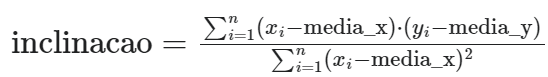

# 📚 Atividade 3 -Cálculo de Regressão Linear

## 👨‍🏫 Instruções

No seu repositório de atividades no github, crie uma pasta chamada atividade3, contendo um arquivo regressao_linear.c que implementa a solução do problema abaixo.

Crie um programa em C que calcula a regressão linear a partir de um array de coordenadas (pontos).

O programa deve receber por argumento o nome de um arquivo no formato ".csv", identificar a quantidade de registros no arquivo e alocar dinamicamente um array de struct Ponto. 

A regressão linear é uma técnica de análise estatística que busca encontrar a linha que melhor se ajusta aos dados, minimizando os erros quadrados.

## 📜 Descrição

### 1️⃣ Leia os pontos (x,y) no arquivo informado.

### 2️⃣ Calcule a média dos valores de x e y.

### 3️⃣ Calcule a inclinação (coeficiente angular) da reta de regressão:

### 4️⃣ Calcule o ponto de intercepção (coeficiente linear) da reta de regressão:

**intercepcao** = **media_y** - **inclinação** * **media_x**

### 5️⃣ - Exiba os resultados da equação da regressão linear:

 **y** = **inclinacao** * **x** + **intercepcao** , onde **y** é a variável dependente e **x** é a variável independente.

Segue anexo o arquivo ".csv" a ser utilizado para teste da solução. Cada linha do arquivo representa um ponto. Os valores de x e y estão separados por ",". A variável x é do tipo int e a variável y é do tipo float. 

Exemplo de execução:

./regressao dados.csv 
Saída: y = 0.8x + 7